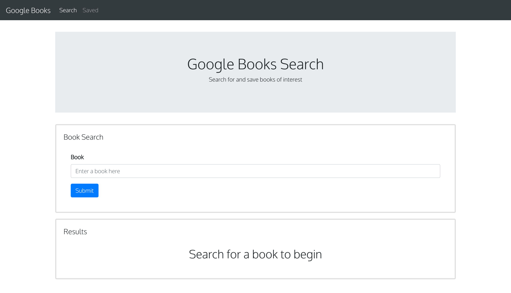
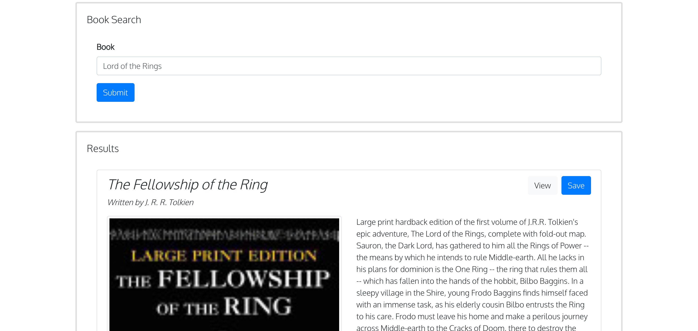
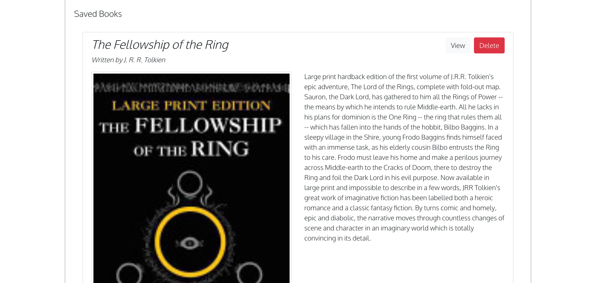

# Google Books Search

## Description

This application allows you to search for any book you would like. When you are presented with the list of books that relate to your search, you can save a specific book to your 'Saved' page. On the 'Saved' page, you have the option to delete the book from the playlist if you so choose.

`See the URL for the deployed appliation:` https://mern-google-book-search.herokuapp.com/

## Table of Contents

- [Installation](#installation)
- [Usage](#usage)
- [License](#license)
- [Questions](#questions)

## Installation

- While in the root directory, run: `npm install`
- After all installations complete, run: `npm start`
- View the app running on <http://localhost:3000>

## Usage

Use this app anytime you need a place to store books your would like to read.

## License

## Questions

For any additional questions, please send me an e-mail at jackson.meier423@gmail.com

Link to my GitHub: https://github.com/meierj423
